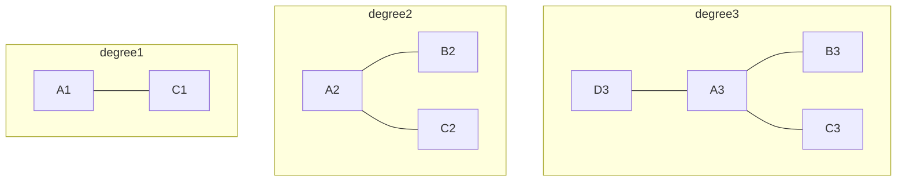
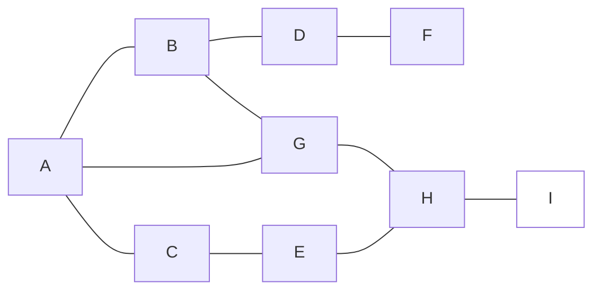
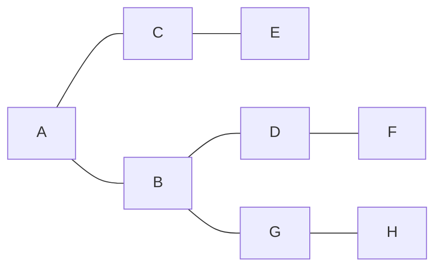

# Maximum-leaf-spanning-tree

###### tags: `Spanning Tree` `algorithm`

**Warning : If pictures are not shown well, click on [GitHub+Mermaid](https://chrome.google.com/webstore/detail/github-%20-mermaid/goiiopgdnkogdbjmncgedmgpoajilohe) to add this extension**

## Description:

Giving an undirected connedted graph G, represented by an **adjacency matrix** A(n*n), and a set of vertices S of G. Please generate a tree T that has the maximal number of leaves (degree > 1) and contains all the vertices in S. Note that if a vertex of G is not in G, it may or may not be in T.

Recall that the definition of the degree of a vertex is the number of edges that are incident to it. See [the wikipedia page of degree](https://en.wikipedia.org/wiki/Degree_(graph_theory)) for more information. 
 
### Necessary and Unecessary

### Degree

## Example:
### Input data  
9 **// It means that this graph has 9 vertices**  
0 1 1 0 0 0 1 0 0  
1 0 0 1 0 0 1 0 0  
1 0 0 0 1 0 0 0 0  
0 1 0 0 0 1 0 0 0  
0 0 1 0 0 0 0 1 0  
0 0 0 1 0 0 0 0 0  
1 1 0 0 0 0 0 1 0  
0 0 0 0 1 0 1 0 1  
0 0 0 0 0 0 0 1 0  
1 1 1 1 1 1 1 1 0 **// A, B, C, D, E, F, G, and H are vertices that are contained in S**  
0 **// End**

### Grahp

### Spanning Tree

Because the degrees of the nodes A, B, C, D, and G are greater than 1  
**Ans : 5**
## Solution:
See main.cpp
